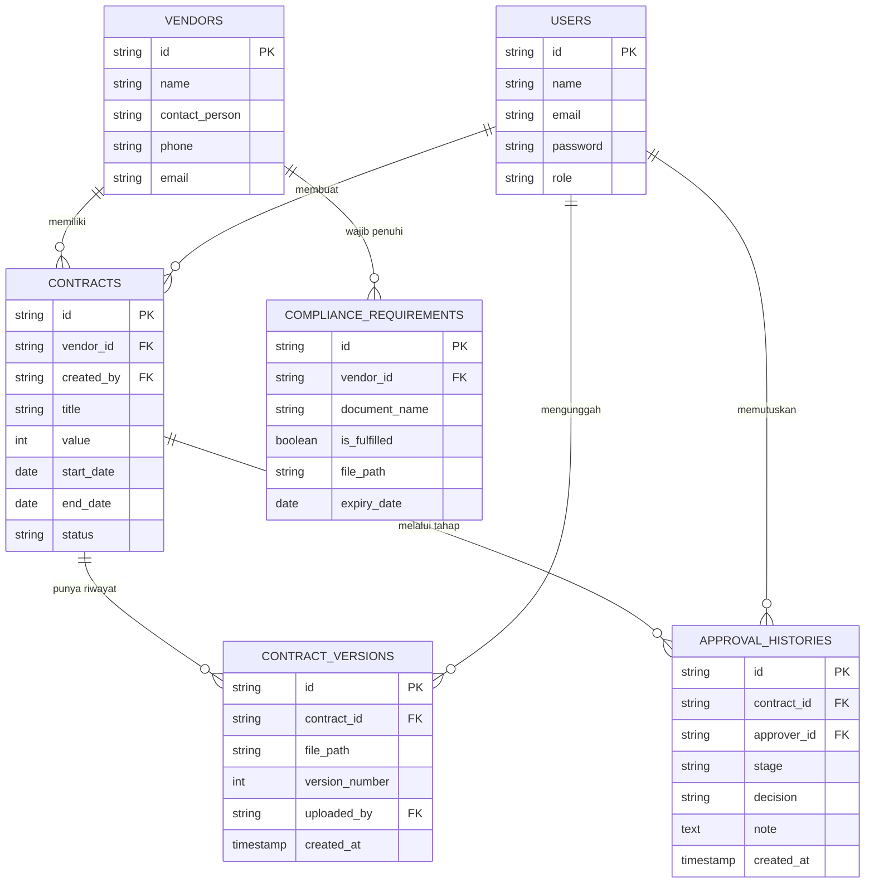

# PRD — Project Requirements Document

## 1. **Overview**
**Vendura** (Vendor + Durable) adalah platform manajemen kontrak dan kepatuhan (*compliance*) vendor berbasis web yang dirancang untuk perusahaan yang bekerja sama dengan banyak vendor/supplier. Aplikasi ini membantu perusahaan mengelola siklus hidup kontrak — mulai dari pengajuan, proses persetujuan berjenjang, hingga pemantauan masa berlaku dan kelengkapan dokumen legal vendor.

**Masalah yang diselesaikan:**
Banyak perusahaan, terutama yang belum punya sistem procurement matang, masih mengelola kontrak vendor secara manual lewat Excel atau folder dokumen fisik/Drive. Akibatnya, kontrak yang mendekati masa kadaluarsa sering tidak terpantau, proses persetujuan kontrak baru tidak punya jejak yang jelas (siapa approve, kapan, kenapa ditolak), dan kelengkapan dokumen legal vendor (izin usaha, sertifikat, dsb) sulit ditelusuri saat dibutuhkan mendadak (misal saat audit).

**Tujuan Utama:**
Menyediakan sistem terpusat di mana tim internal (Manager, Finance, Direktur) bisa mengelola kontrak vendor dengan alur persetujuan yang jelas dan terekam, mendapat notifikasi otomatis sebelum kontrak *expired*, serta memantau kelengkapan dokumen kepatuhan tiap vendor dalam satu dashboard.

## 2. **Requirements**
- **Manajemen Kontrak Terpusat:** Setiap kontrak vendor tercatat dengan detail lengkap (masa berlaku, nilai kontrak, dokumen terlampir) dalam satu sistem.
- **Alur Persetujuan Berjenjang (Approval Workflow):** Kontrak baru atau revisi kontrak wajib melewati tahapan persetujuan berurutan (Manager → Finance → Direktur) sebelum berstatus aktif.
- **Jejak Audit Persetujuan:** Setiap tahap approve/reject harus tercatat — siapa yang memproses, kapan, dan alasan penolakan (jika ada).
- **Notifikasi Otomatis Kontrak Mendekati Expired:** Sistem mengirim reminder terjadwal (H-30, H-7, H-1) ke pihak terkait sebelum kontrak berakhir.
- **Document Versioning:** Setiap revisi dokumen kontrak disimpan sebagai versi baru, bukan menimpa versi lama, agar histori perubahan tetap bisa ditelusuri.
- **Compliance Checklist per Vendor:** Setiap vendor punya daftar dokumen wajib (izin usaha, sertifikat, NPWP, dll) yang bisa ditandai lengkap/belum lengkap.
- **Kontrol Akses Berbasis Peran (Role-based Access):** Fitur dan data yang bisa diakses berbeda antara Admin, Manager, Finance, dan Direktur.
- **Dashboard & Pelaporan:** Ringkasan kontrak yang mau expired, status compliance tiap vendor, serta total nilai kontrak aktif.

## 3. **Core Features**
- **Dashboard Admin:** Panel utama menampilkan ringkasan kontrak aktif, kontrak mendekati expired, dan status approval yang masih pending.
- **Manajemen Kontrak (CRUD):** Fitur untuk membuat, melihat, mengubah (dengan versioning), dan mengarsipkan kontrak vendor beserta dokumen pendukungnya.
- **Approval Workflow Engine:** Sistem status berjenjang (`Draft` → `Menunggu Manager` → `Menunggu Finance` → `Menunggu Direktur` → `Aktif`/`Ditolak`) lengkap dengan histori keputusan tiap tahap.
- **Reminder Kontrak Otomatis:** Job terjadwal yang mengecek tanggal expired kontrak setiap hari dan mengirim notifikasi (email/in-app) sesuai ambang waktu yang ditentukan.
- **Manajemen Compliance Vendor:** Fitur kelola daftar dokumen wajib per vendor beserta status kelengkapannya (upload, verifikasi, expired dokumen).
- **Riwayat Versi Dokumen:** Tampilan daftar versi dokumen kontrak dengan kemampuan melihat/mengunduh versi sebelumnya.

## 4. **User Flow**

**a. Alur Pengajuan Kontrak (Admin/PIC Vendor):**
1. *Login* ke sistem sesuai peran masing-masing.
2. Membuat kontrak baru: mengisi data vendor, nilai kontrak, masa berlaku, dan mengunggah dokumen kontrak.
3. Mengirim kontrak untuk diproses — status berubah menjadi *Menunggu Manager*.
4. Menerima notifikasi jika kontrak disetujui atau ditolak pada tahap manapun.

**b. Alur Persetujuan Berjenjang (Manager → Finance → Direktur):**
1. Manager menerima notifikasi ada kontrak baru yang perlu direview.
2. Manager membuka detail kontrak, memeriksa dokumen, lalu memilih **Setujui** atau **Tolak** (wajib isi alasan jika tolak).
3. Jika disetujui, status otomatis berpindah ke tahap berikutnya (Finance), begitu seterusnya hingga Direktur.
4. Jika ditolak di tahap manapun, kontrak kembali ke status *Draft* dengan catatan alasan penolakan untuk direvisi Admin/PIC.
5. Setelah disetujui Direktur, status kontrak menjadi **Aktif** dan mulai dipantau sistem untuk pengingat expired.

**c. Alur Pemantauan Compliance & Reminder (Sistem & Admin):**
1. Sistem menjalankan job harian untuk mengecek tanggal expired seluruh kontrak aktif.
2. Jika kontrak masuk rentang H-30/H-7/H-1, sistem mengirim notifikasi ke Admin dan PIC terkait.
3. Admin memantau dashboard compliance untuk melihat vendor mana yang dokumennya belum lengkap/kadaluarsa, lalu menindaklanjuti langsung ke vendor bersangkutan.

## 5. **Architecture**
Sistem menggunakan arsitektur *monolithic* berbasis **Laravel** sebagai backend sekaligus penyedia *API*, dengan **React** (via **Inertia.js**) sebagai lapisan antarmuka, sehingga tetap terasa seperti *Single Page Application* tanpa perlu membangun API terpisah penuh. Proses notifikasi terjadwal dan pengiriman reminder ditangani melalui **Queue & Job** agar tidak membebani proses utama aplikasi.

```mermaid
sequenceDiagram
    actor Admin/PIC
    participant Frontend (React + Inertia)
    participant Backend (Laravel)
    participant Queue Worker
    participant Database
    actor Manager/Finance/Direktur

    Admin/PIC->>Frontend (React + Inertia): Buat kontrak baru & upload dokumen
    Frontend (React + Inertia)->>Backend (Laravel): Kirim data kontrak (POST)
    Backend (Laravel)->>Database: Simpan kontrak (status: Menunggu Manager)
    Database-->>Backend (Laravel): Konfirmasi simpan
    Backend (Laravel)-->>Frontend (React + Inertia): Notifikasi kontrak terkirim

    Manager/Finance/Direktur->>Frontend (React + Inertia): Buka daftar approval pending
    Frontend (React + Inertia)->>Backend (Laravel): Fetch kontrak sesuai tahap
    Backend (Laravel)->>Database: Query kontrak by status & role
    Database-->>Backend (Laravel): Return data kontrak
    Backend (Laravel)-->>Frontend (React + Inertia): Tampilkan detail kontrak

    Manager/Finance/Direktur->>Frontend (React + Inertia): Klik Setujui/Tolak
    Frontend (React + Inertia)->>Backend (Laravel): Update status & catat histori (PATCH)
    Backend (Laravel)->>Database: Simpan approval_history & update status kontrak
    Database-->>Backend (Laravel): OK

    Queue Worker->>Database: Job harian cek kontrak mendekati expired
    Database-->>Queue Worker: List kontrak H-30/H-7/H-1
    Queue Worker->>Admin/PIC: Kirim notifikasi reminder
```

## 6. **Database Schema**
Aplikasi menggunakan sistem database relasional. Relasi utama mengikuti alur: Vendor → Kontrak → Riwayat Versi & Riwayat Approval, serta Vendor → Compliance Requirement.

**Daftar Tabel dan Kolom:**

1. **`Users` - Pengguna Internal Sistem**
   - `id` (UUID/Integer): *Primary Key*.
   - `name` (String): Nama pengguna.
   - `email` (String): Untuk *login*.
   - `password` (String): Kata sandi terenkripsi.
   - `role` (String): Enum (`ADMIN`, `MANAGER`, `FINANCE`, `DIREKTUR`).

2. **`Vendors` - Data Vendor/Supplier**
   - `id` (UUID/Integer): *Primary Key*.
   - `name` (String): Nama vendor.
   - `contact_person` (String): Nama PIC vendor.
   - `phone` (String): Nomor kontak vendor.
   - `email` (String): Email vendor.

3. **`Contracts` - Data Kontrak**
   - `id` (UUID/Integer): *Primary Key*.
   - `vendor_id` (String/Integer): *Foreign Key* ke tabel *Vendors*.
   - `created_by` (String/Integer): *Foreign Key* ke tabel *Users* (pembuat kontrak).
   - `title` (String): Judul/nama kontrak.
   - `value` (Integer): Nilai total kontrak.
   - `start_date` (Date): Tanggal mulai berlaku.
   - `end_date` (Date): Tanggal berakhir kontrak.
   - `status` (String): Enum (`DRAFT`, `MENUNGGU_MANAGER`, `MENUNGGU_FINANCE`, `MENUNGGU_DIREKTUR`, `AKTIF`, `DITOLAK`, `EXPIRED`).

4. **`Contract_Versions` - Riwayat Versi Dokumen Kontrak**
   - `id` (UUID/Integer): *Primary Key*.
   - `contract_id` (String/Integer): *Foreign Key* ke tabel *Contracts*.
   - `file_path` (String): Lokasi penyimpanan file dokumen.
   - `version_number` (Integer): Nomor urut versi.
   - `uploaded_by` (String/Integer): *Foreign Key* ke tabel *Users*.
   - `created_at` (Timestamp): Waktu unggah versi ini.

5. **`Approval_Histories` - Jejak Persetujuan Berjenjang**
   - `id` (UUID/Integer): *Primary Key*.
   - `contract_id` (String/Integer): *Foreign Key* ke tabel *Contracts*.
   - `approver_id` (String/Integer): *Foreign Key* ke tabel *Users*.
   - `stage` (String): Enum (`MANAGER`, `FINANCE`, `DIREKTUR`).
   - `decision` (String): Enum (`APPROVED`, `REJECTED`).
   - `note` (Text): Catatan/alasan keputusan.
   - `created_at` (Timestamp): Waktu keputusan diambil.

6. **`Compliance_Requirements` - Dokumen Wajib per Vendor**
   - `id` (UUID/Integer): *Primary Key*.
   - `vendor_id` (String/Integer): *Foreign Key* ke tabel *Vendors*.
   - `document_name` (String): Nama dokumen wajib (misal: "Izin Usaha", "Sertifikat ISO").
   - `is_fulfilled` (Boolean): Status kelengkapan dokumen.
   - `file_path` (String, nullable): Lokasi file dokumen yang diunggah.
   - `expiry_date` (Date, nullable): Tanggal kadaluarsa dokumen (jika berlaku).



## 7. **Tech Stack**
Berikut adalah rekomendasi arsitektur teknologi yang selaras dengan fokus pengembangan skill backend dan cocok untuk dijadikan bahan portofolio:

- **Framework Backend:** **Laravel** — menangani seluruh business logic, khususnya *approval workflow* berjenjang, validasi, dan *job scheduling* untuk reminder kontrak.
- **Frontend & Interaktivitas:** **React** dipadukan dengan **Inertia.js**, sehingga antarmuka terasa seperti SPA tanpa perlu membangun REST API terpisah secara penuh.
- **Autentikasi & Otorisasi:** **Laravel Sanctum** untuk sesi login, dikombinasikan dengan **Gate/Policy** bawaan Laravel untuk kontrol akses berbasis peran (Admin, Manager, Finance, Direktur).
- **Database:** **PostgreSQL** — dipilih karena kebutuhan Vendura banyak melibatkan relasi ketat dan query analitik (approval history, versioning, compliance reporting), yang lebih diuntungkan oleh dukungan native `ENUM`, `CHECK constraints`, dan kemampuan query kompleks (window functions, CTE) milik PostgreSQL.
- **Queue & Job Scheduling:** **Laravel Queue** (driver Redis/database) dikombinasikan dengan **Laravel Scheduler** untuk menjalankan job harian pengecekan kontrak mendekati expired.
- **Caching:** **Redis** — digunakan untuk *cache* data dashboard (ringkasan kontrak aktif, status compliance) agar query berat tidak dijalankan berulang.
- **Penyimpanan File:** **Laravel Filesystem** (local storage untuk development, bisa diarahkan ke S3-compatible storage saat produksi) untuk menyimpan dokumen kontrak dan compliance.
- **Export Laporan:** **DomPDF** untuk mengekspor ringkasan kontrak/laporan compliance ke format PDF.
- **Containerization & Deployment:** **Docker** (custom `docker-compose.yml` untuk Laravel + PostgreSQL + Redis) di-*deploy* ke **VPS** dengan **Nginx** sebagai web server dan **Supervisor** untuk menjaga proses queue worker tetap berjalan.